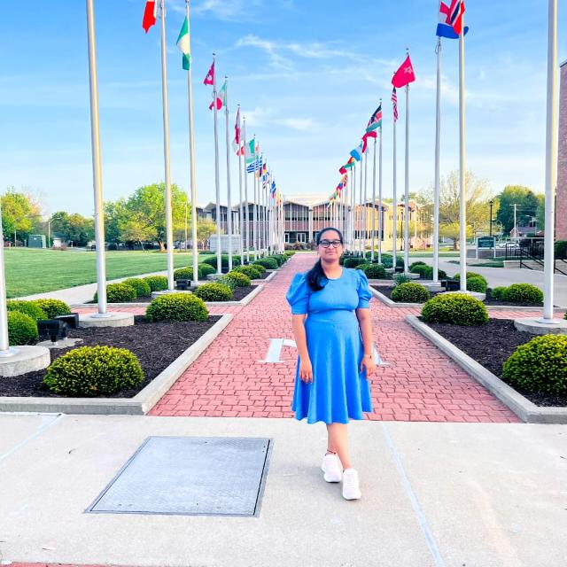

# Sravya Vannemreddy

I like to travels all around the world as possible as i can. I also more passionate about Gaming. and also i love to eat a lot of delicious food items.




# Sports that i recommend

Here i would like to give a table representation of few sports that would be recommended

|**Sport name**| **Why to play**                                               | **hours** |
|:-------------|:-------------------------------------------------------       |----------:|
|Badminton     | It is good for fitness                                        | 2 hours   |
|Chess         | It is a mind game which improves our thinking level           | 3 hours   |
|Basket ball   | It helps in the mind balance and burn calories                | 2 hours   |
|Carromboard   | Quick thinking and sharpens the mind and better predictions   | 3 hours   |

# Pithy quotes of few scientists that i like

> "And yet it moves" or " Although it does move"
>
> -- *Galileo*

 
> "I've loved the stars too fondly to be fearful of the light"
>
> -- *Plato*

# Code fencing of code snippet

> "How to get the first image from post?"
>
>[Quick link to the article of getting first image from post in wordpress](https://stackoverflow.com/questions/21975301/how-to-get-the-first-image-from-post)

```
function catch_that_image() {
  global $post, $posts;
  $first_img = '';
  ob_start();
  ob_end_clean();
  $output = preg_match_all('//i', $post->post_content, $matches);
  $first_img = $matches[1][0];

  if(empty($first_img)) {
    $first_img = "/path/to/default.png";
  }
  return $first_img;
}
```

[Code snippet url to get first image from wordpress](https://css-tricks.com/snippets/wordpress/get-the-first-image-from-a-post/)
